# The Adaventure

The [*Oxford Learner's Dictionaries*](https://www.oxfordlearnersdictionaries.com/definition/english/woke_2) define **woke** as: aware of social and political issues, especially racism. Our society is slowly evolving towards a feeling of inclusion and equality for different social groups. This is reflected by an effort to give equal opportunities and representation to minorities  in the media. In this project we will put the focus on ethnic diversity in the film industry worldwide. For this goal, we will use the movie metadata from the November 4, 2012 dump of Freebase to compare the representation of different ethnicities in different countries of production, and study their evolution over time.

1. this list will be replaced by the toc
{:toc .large-only}

## Data Overview

In this project, we are going to work on the representation of the ethnicity in movies from different datasets. We have approximately 450 000 characters aligned in the file `'character.metadata.tsv'` which was extracted on November 4, 2012 from freebase. It is the main data that we are going to use, as it contains the ID of the ethnicity. We are only going to keep 9 features, as the other features are not useful for our analysis. We will also drop the characters with unspecified ethnicity. Data after 2012 will be removed as our data is extracted from 1920 to 2012 and we don't have enough movies for 2012. 

From an initial exploration of the data, we could see that the dataset contains 476 different ethnicities, with the first few representing the vast majority; many ethnicities have only one actor in the dataset. Because the distribution is heavy tailed, ethnicities are represented below with a log axis.

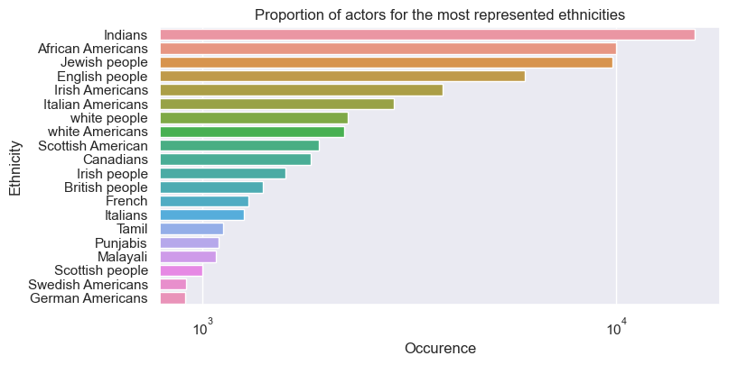
Barplot showing the occurrence of different ethnicities in a log scale.
{:.figcaption}

### Proportion of different ethnicities over time

After cleaning our dataset, we started by plotting the evolution of the total number of ethnicities present in movies over the years.

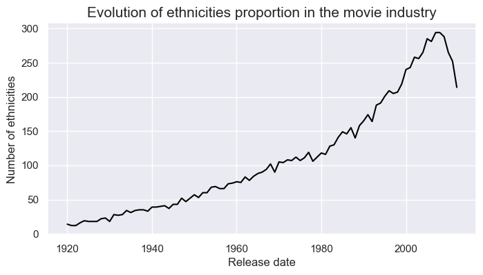


### Number of movies by country over time
If we want to extract meaningful information from our data, we must first take into account different aspects and biases. In order to explore the 

> ***NOTE :***
First, we will examine the number of films produced in the two major film producing countries: `India`  and the `United States`. 

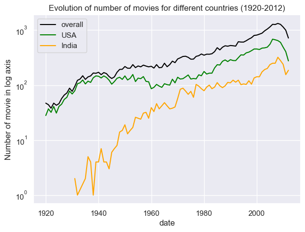

---
**Conclusion**

The timeline is not good because we can see that Indian movies are only represented after 1930, and they are also much less present in the dataset until 1960-1970. Thus, we can try to look at the data after56 1970.

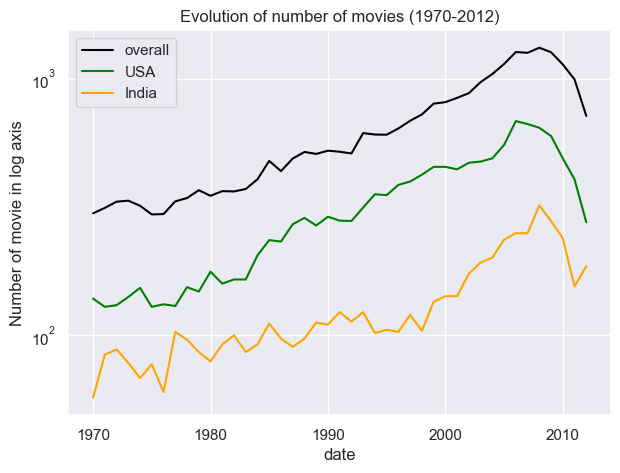

---

---
**Conclusion**

We have a much better representation of the data set after 1970, with the same proportion of Indians and Americans in each period; we will use this time frame for the rest of our analysis. 

---

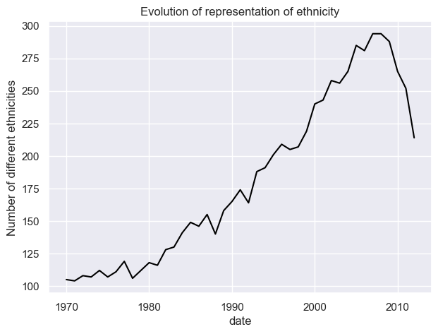

## How is ethnic diversity represented in each country's film industry?<a name="paragraph3"></a> 
Looking deeper in the dataset for various geographic areas : `US`, `China`, `India`,`Europe`. 


### China

Unfortunately, our dataset didn't contain enough movies produced in China to extract any significant conclusions.

### USA

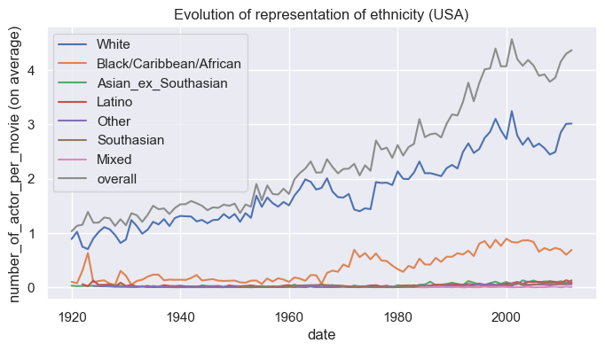

Black and white populations appear to be increasingly represented in the film industry. However, the overall number of actors per film is increasing.

> ***NOTE :***
To determine the true trend in ethnic representation in the movie industry, we will normalize the number of actors by ethnic group by the total number of actors.

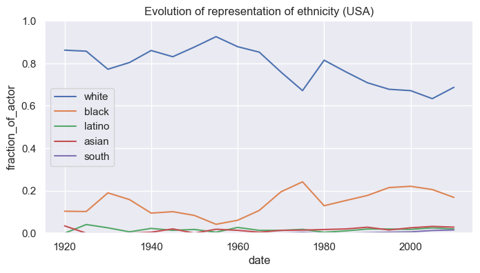

---
***Conclusion***

The results are quite surprising: while white actors are less represented over time, while black actors are more represented, but not significantly so. Others ethnic groups doens't appear to be more represented over time. Why does it not add up to 1? People of mixed race are not taken into account. Conclusion: Things are improving, with more black and mixed ethnicities are being more represented. Asian not so much, despite the large Chinese diaspora.

---


### India

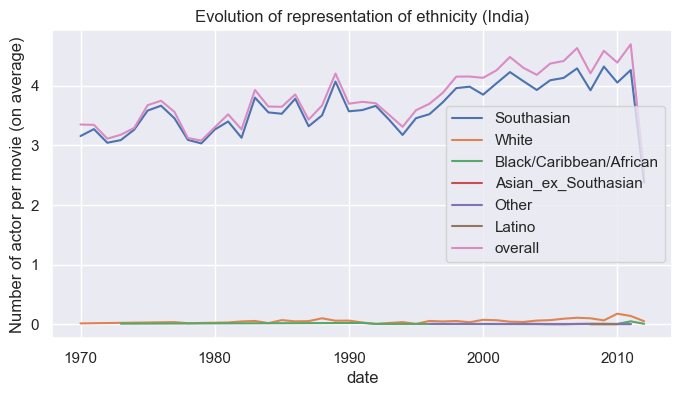


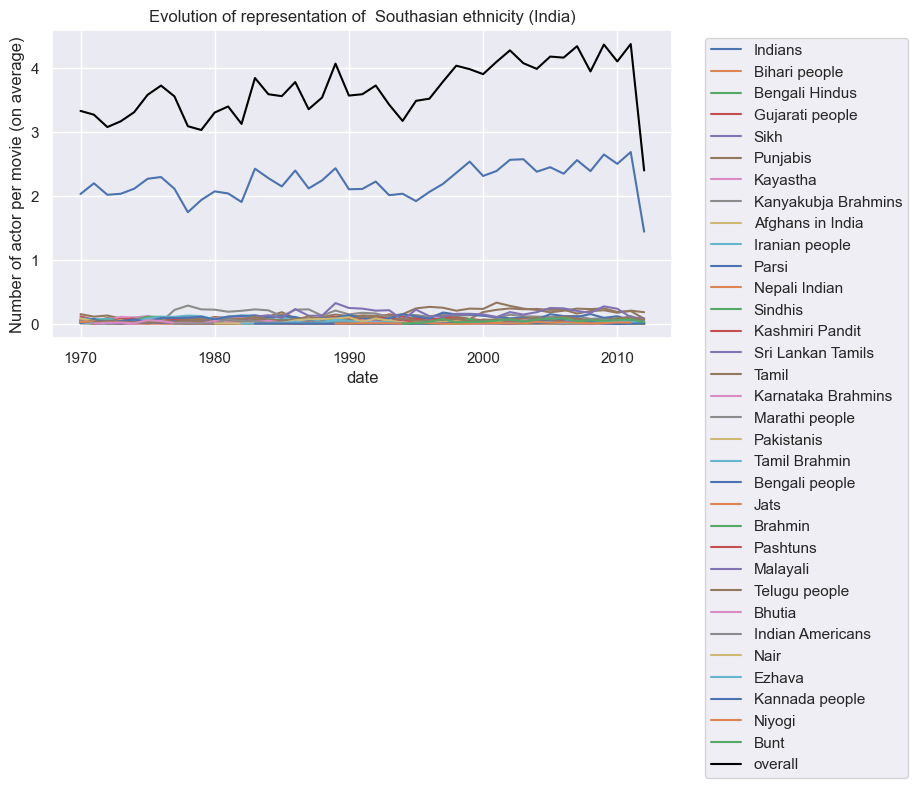

### Europe

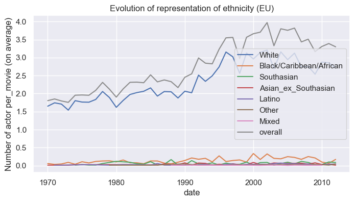

Taking europe as a whole, we can observe a very strong representation of white people. Perhaps better to look at each country indivudually and look at ethnicity and not groups.

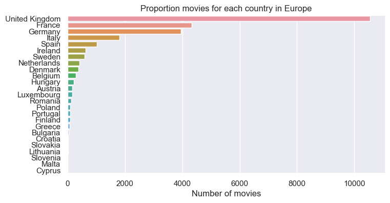

> **NOTE :**
We will look more closely to the 3 countries with more movies : `UK`,`France`,`Germany`.

#### UK

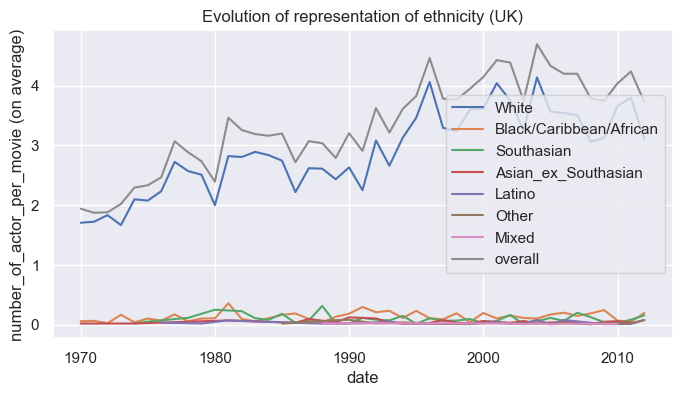


#### France


---
**Conclusion**

There is a much better representation with a quite a good proportion of Americans actors and jewish people but the rest are mainly from neighbour countries. 

---

#### Germany

---
**Conclusion**

Surprisingly, a large number of African Americans. There isn't much German. Many ethnicities are represented, including neighboring countries as well as American countries. The dataset appears to be highly flawed.

---

### Top 100 movies

We chose to look at the 100 most famous movies based on the dataset's column **`revenue`** to examine them in greater depth. Then we will examine the countries that produced the films, as well as the ethnic representation in terms of ethnic group and overall.


Clearly, the United States has the most movies and the highest revenue, followed by India and the United Kingdom. We will now look at the top movies.

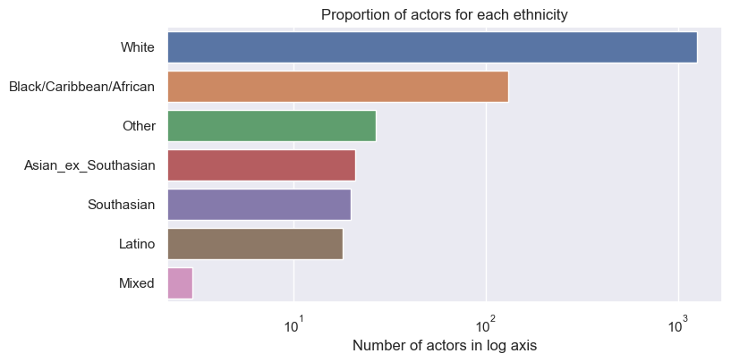

---
**Conclusion**

Because the top countries are mostly made up of Americans, the ethnic representation is quite skewed. As before, there is a large representation of white. There are many ethnicities, but they are not well represented. Black people appear to be more represented than other ethnic groups, with the exception of white people.

---


## Diversity score

One of the key goals of our project is to quantify the `ethnic diversity` present in our dataset. To achieve this, we need to find a metric or score that will allow us to determine the extent to which different ethnicities are represented in the data we are analyzing. This will help us understand the level of diversity within the dataset and identify any potential imbalances or disparities.

### Entropy score

Entropy is a measure of randomness or disorder within a system. In the context of ethnic diversity, entropy can be used to quantify the degree of variety within a population with respect to ethnicity.

To calculate the entropy of a population with respect to ethnicity, we used the following formula:

**Entropy = - ∑(pi * log2(pi))**

where pi is the proportion of individuals in the population belonging to each ethnic group. The sum is taken over all ethnic groups present in the population.

Using this formula, we will calculate the entropy of a population and compare it to other populations to assess the level of ethnic diversity. A population with a higher entropy would indicate a greater degree of ethnic diversity, while a population with a lower entropy would indicate less ethnic diversity.


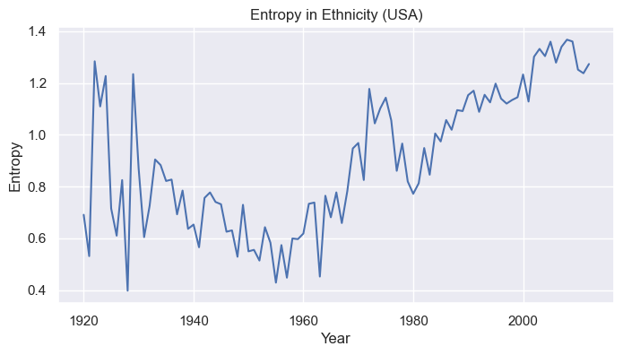


---
**Conclusion**

The entropy is quite high from 1920 to 1940, indicating a really high variability, but as previously stated, our dataset is primarily composed of movies from 1970 to 2010, so this variability is most likely explained by the low number of movies.  
After 1960 the entropy is clearly increasing indicating evermore diversity.

---


### Simpson index


The Simpson index is a measure of diversity within a population that takes into account both the number of different ethnic groups present and the relative proportions of each group. It is calculated using the following formula:

**Simpson Index = 1 - ∑(pi^2)**

where pi is the proportion of individuals in the population belonging to each ethnic group. The sum is taken over all ethnic groups present in the population.

The Simpson index ranges from 0 (complete uniformity, with all individuals belonging to the same ethnic group) to 1 (complete diversity, with each ethnic group represented equally). A population with a higher Simpson index would indicate a greater level of ethnic diversity, while a population with a lower Simpson index would indicate less ethnic diversity.

The Simpson index is useful for quantifying ethnic diversity because it takes into account both the number of different ethnic groups present and the relative proportions of each group.

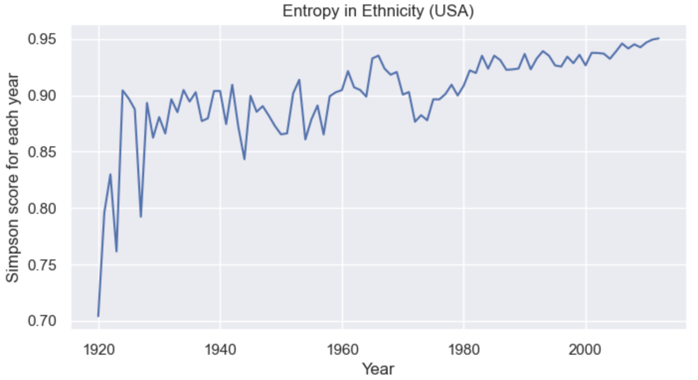


---
**Conclusion**

Looking at the data, we can see that overall diversity is increasing over time, with a particularly strong increase from 1920 to 1925 and a slower increase until 2000. There is a noticeable decrease in diversity around 1975. This diversity score seems more realisatic showing more diversity over time in the movie industry with less variation than the entropy score.  

This score will be used in the following analysis because it is a good index for diversity as it takes into account the number of data points in each year.

---


> **NOTE :**
We will first group all of the movies by their wikipedia ID to calculate the diversity score of their actors, and then we will conduct an analysis to see if there is more diversity over time, as diversity representation is a hot topic these days, and we expect to see more diversity in western movies: Europe, USA, Canada...

**1. Calculate the diversity score**

First we have to calculate for each movie the diversity score (simpson) using actors `ethnicities` in each movies.

    
**2. Conduct a statistical test to determine whether there is a statistical difference between the different time periods**
   
Then we will run a statistical test on all of the dataframe's periods. To group movies by periods and have enough data, we will choose data from 1940 to 2010 and place each movie in a 10-year period.

    
**3. Create a heatmap with the p values for each period** 

We will store all of the p values in a 2D matrix (same period for the 2 entries) and generate a symetrical heatmap to show whether the p value is low or high, allowing us to determine whether the divergence is statistically significant.


#### T-test for different time periods

To begin, we must change the date to obtain all movies from a 10-year period in only one category, and then we will calculate the diversity score for each movie, excluding movies with fewer than four actors.

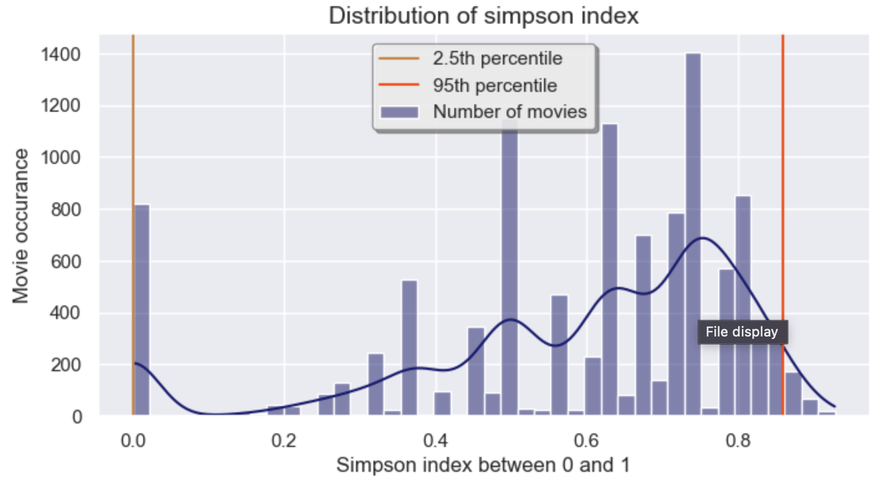

As our distribution is not normal we will use the **Kruskal-Wallis** test. It is a non-parametric statistical test that will be used to compare the diversity of ethnicities in different periods of time. It is commonly used when the data are not normally distributed or when the assumptions of other parametric tests, such as the one-way ANOVA, are not met.

Next, you will use the Kruskal-Wallis test to determine whether there is a statistically significant difference in the diversity of ethnicities between the different periods of time. To do this, we will calculate the test statistic called the H-value.

If the H-value is found to be statistically significant at a predetermined level of significance (0.05), it suggests that there is a significant difference in the diversity of ethnicities between the different periods of time. If the H-value is not statistically significant, it suggests that there is no significant difference in diversity between the periods.


#### Heatmap of p_value diversity for each period


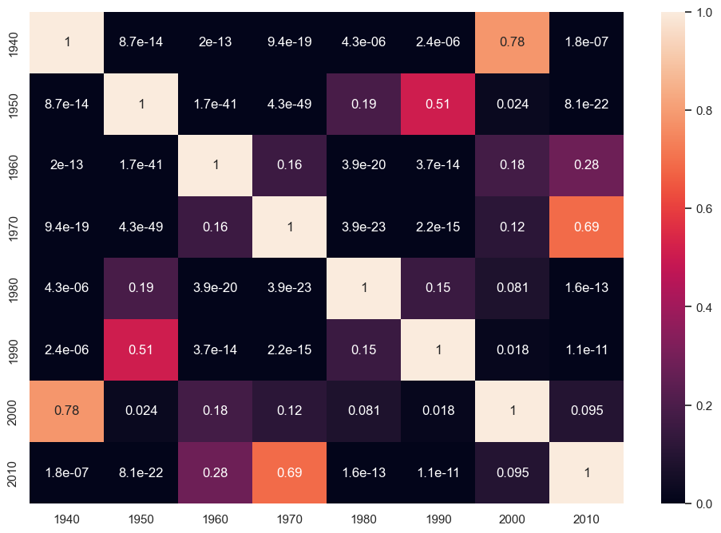

---
**Conclusion**

Because we are comparing the same values, it is obvious that it is a simetrical matrix; additionally, the p value for the t test comparing the same data in the diagonal is 1 because there is no difference at all. It was to be expected. Other findings are more surprising, and they can be investigated using a confidence interval and mean ethnic score for each period to determine whether diversity is increasing or decreasing over time. 
Surprisingly, the p value is high between 1940 and 2000, implying that the null hypothesis is not rejected and that diversity is not significantly different between these two periods; the same conclusion is reached for 1950, 1980/1990, but also 1970/1960 and 2010. A more detailed analysis is provided below.

---

#### Mean diversity score for each period

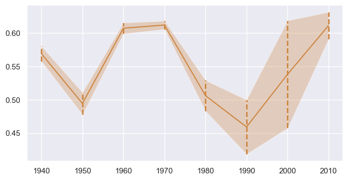

---
**Conclusion**

The data show a quite interesting story, overall looking at the entire dataset we cannot say really that diveristy increases for actors in movies as there is not a real difference between 1960/1970 and now but we can say that since 1990 diveristy increase significaly (looking at the p_values that are pretty low and indicate a significant difference in diversity). To understand the data and its variability better we could show the diversity for different countries, we could try to do the same analysis but for USA, India and Europe. 

---

## Correlation between success and actor ethnic diversity

To analyse in more detail the ethnic representation in the movie industry, we can look at the more successful movie and the ethnic diversity in such. First we have to define a successfull movie we have in the dataset two datas that can be used : box-office and the number of movies. 

On the all dataset only 28% have a data for the revenue, it is not a lot as it's overall for all the countries on a long period of time. We can look at the distribution and see if it's relevant to work with this data. 

Looking at the data, we most of our data are for the USA and is much less for others countries. As it makes more sens to look at the ethnic deiversity in a country we will not use data with less than 1000 data because we will look in these datas as multiple ethnicities that will again dampen the number of data we have. We can select 5 countries with more data and see looking at the ethnic representation if we have cluster on the revenue. 


We prefer to work with another data for the success, as we don't have enought data in the revenu. We will define now the success for a movie as the success of actors playing in this movie. First to implement this we will look at the actors in the dataset and calculate the number of movies for each to define a ranking of successfull actors. 

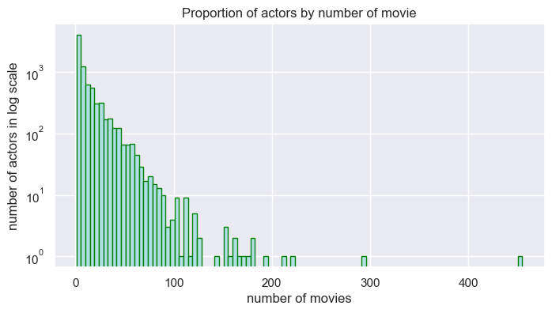

We used a log scale as the distribution look more like a power low distribution. We can see that most actors have played less than 100 movies. We will use an arbitrary threshold and definition of success as the 10% actors with the most movies are the famous one. 

Now that we have famous actors we want to find famous movies in the dataset, a new rule is that we consider a movie successfull if there is more than two famous actors playing in it. 

Now that we obtained the table with our famous movies we will look at some simple analysis like from which countries these movies are, or is there some diversity overall in the datas. A deeper analysis on the diversity with observational studies will be made later on. 

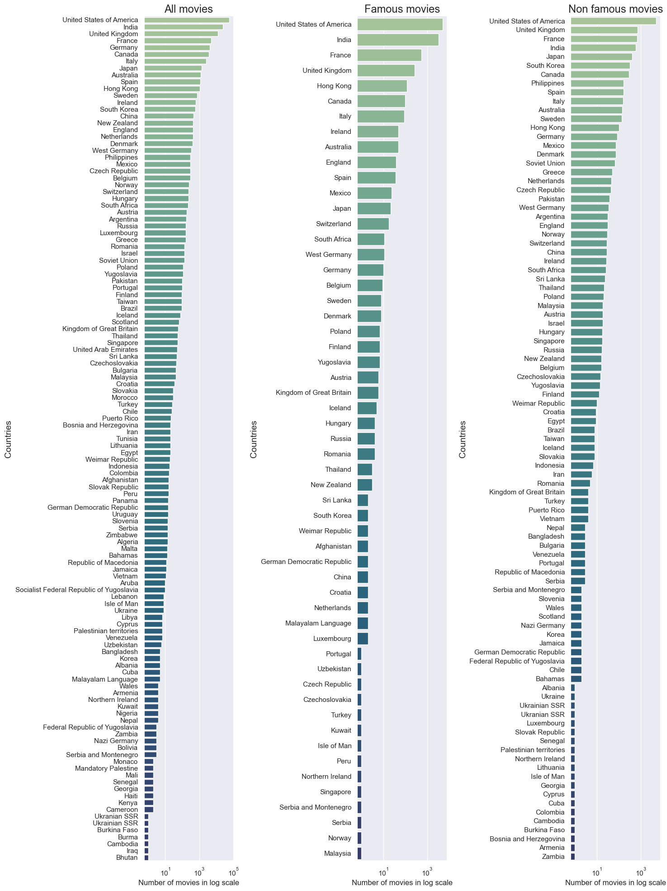


We can already tell just looking at the data that we have different data for famous and non famous movies, as checked before we have a similar number of movies for the two dataset but we have different number of countries producing: 90 different countries for the non_famous and 50 for the famous one. Again looking in more detail we can see difference in the movies producing famous or non famous countries. 


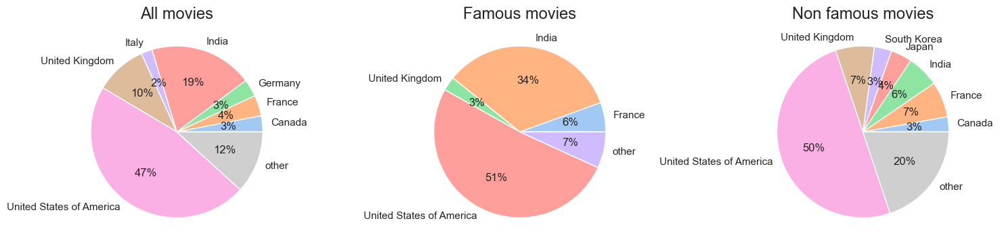

As expected the famous movies are more present in US, India and Europe, we also have a good number of data for the Canada. As we have outliers like the United State of America and the distribution is more a distribution we used a log axis for the number of famous movies. Now we will look more into the ethnic diversity in these famous overall and in the main countries producing these movies. 


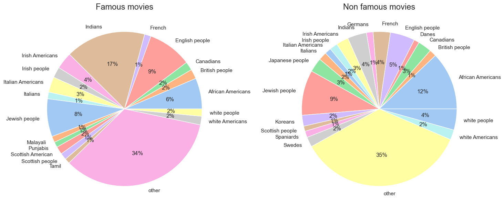

Now to have a real estimation of the diversity and if there is a difference in ethnic representation for movie with success and without it, we will do an observational study by finding for each successfull movie an non successful one, for that we will look at different criterias. First the country movie has to me matched, secondly the year of production obviouly as to match maybe not the exact same year but we will do it 5 years by 5 years. Lastly the number of actors playing in the movie has to be similar to obtain a significant result. For that we will match cast that have more or less the same number of actors in 2 actors difference. After the matching we will use a linear regression to see if there is a difference in the ethnic diversity by printing a linear table of the diversity score for the two groups (successfull and non successfull movies). 
To understand a score and show diversity, we will calcularte the ethnic diversity with simpson's diversity index.

### Observational study?
### Linear regression

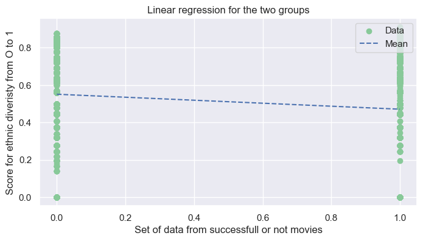

---
**Summary linear regression**

The intercept 0.4713 is the mean outcome for the simpson index representing diversity for famous movies (x=0). The slope 0.08 is the difference in mean outcomes between the diversity index for x=1 (non_successfull movies) and x=0. It means that for famous movies the diversity of the actors playing in it is superior by 0.08 than for actors playing in non famous movies. Thus, there is a significant difference in diversity between the two groups of movies. To validate this conclusion, we can look at the p value, which is very low. The null hypothesis is rejected: there is a significant difference in diversity for famous or non famous movies.

---

## Correlation between gender and actor diversity

### Visualization of gender proportion

Gender as ethnicity is a big subject for the society nowedays, we will look at the ethnic diversity and if there is a difference in representation between man and female. First we will just look at a few datas on the gender and how they are represented in the datas we have. 

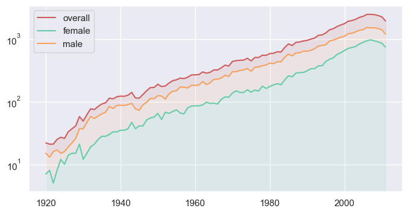

Looking at the data, overall there is always more men than women actors. To have a better overview of gender representation we will more closely look at each movie and the number of men and women for each cast; we will show over time the proportionality of gender in casts. 

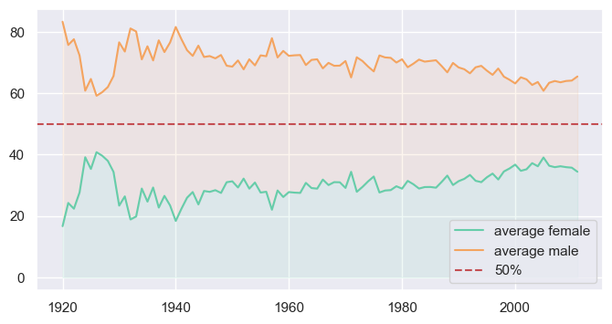

We can see a slow increase of female in movie cast, a strange data is represented around 1930, as we look in detail in the data we don't have a lot of data for this date. There is probably an explanation.


Again to see the diversity representation for the two genders we will conduct an observationnal study, we will match one female and one male actor : 
1. Match the number of movies
    ```
    First for to be fair we have to match movies by their numbers of actors, as obviously a movie with 14 actors as more chance to have a good diversity than a movie with only two actors. 
    ```

2. Match their age 
   ```
   Secondly we will match each movie by their countries movies, as some countries have diversity in actors than other (see analysis made earlier). 
    ```
3. Match the country of production 
   ```
   We will conduct this analysis only for the the biggest countries: United State, India and Europe

    ```
4. Diversity score calculation 
   ```
   We will calculate the diversity score for men and woman for each years 
   
    ```
5. T_statistic
   ```
   We will check the distribution of the diversity score (normal or not) to choose the tests we want to use 
   
    ```
    
    
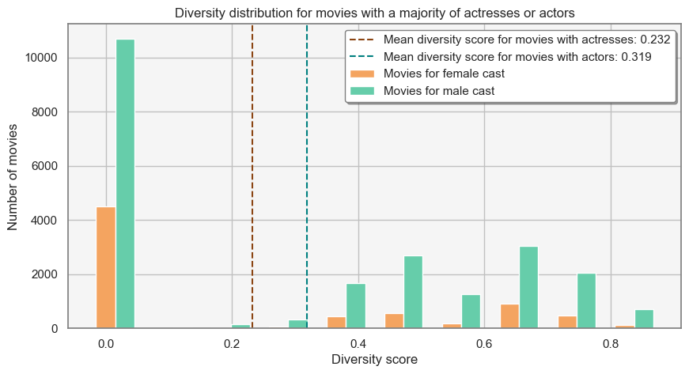

We can conclude looking at the plot that a good part of the movies have no diversity (same ethnicity for all the actors in the cast), it's more prevalant for movies with a majority of female in the cast. As a consequence the mean diversity for movies with a majority of female is lower which is interesting, we will analyse

### T-test

Table?

## Sentimental analysis

### Score on summary??

Using the sentimental analysis, we will only look at data movies with more than 4 actors in it. We will compute the diversity percentage and merge with previous `df_sent` and try to look for a relation.


### Linear regression

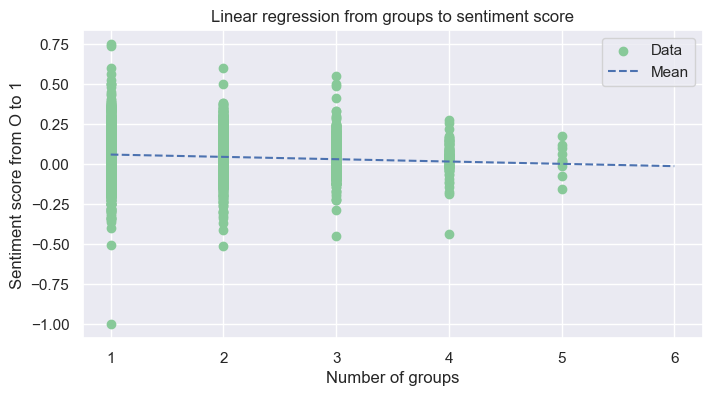

---
**Summary linear regression**

The R-squared value of 0.008 indicates that the model explains a small portion of the variance in the dependent variable (sentiment score). The adjusted R-squared value of 0.007 is similar, and indicates that the model accounts for a small amount of the variance in the dependent variable after accounting for the number of variables in the model. The F-statistic and its corresponding p-value of 40.82 and 1.81e-10, respectively, indicate that the model as a whole is statistically significant. We can see that the mean of each groups is nearly the same. We can infer that the diversity of a movie doesn't influence the the sentiment score based on summaries (small variation. decrease by 0.0145 per unit).

---

### Movie genre

For each groups, take the top 20 of the most popular genres with pie graph ?


Table test

|                               | somethin            | whatever            |
|:------------------------------|:-------------------:|:-------------------:|
| 1.                            | a            | s           |
| 2                 | d           | f       |
| 3        | meh        | bla            |
| 4                   |    idk                 | coucou            |
|===============================+=====================+=====================|
{:.gumroad-button data-gumroad-single-product="true"} |
{:.stretch-table.dl-table}
